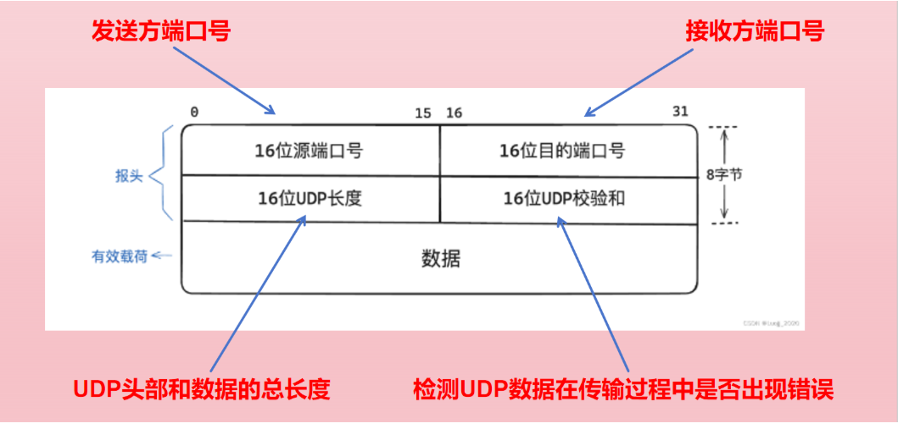
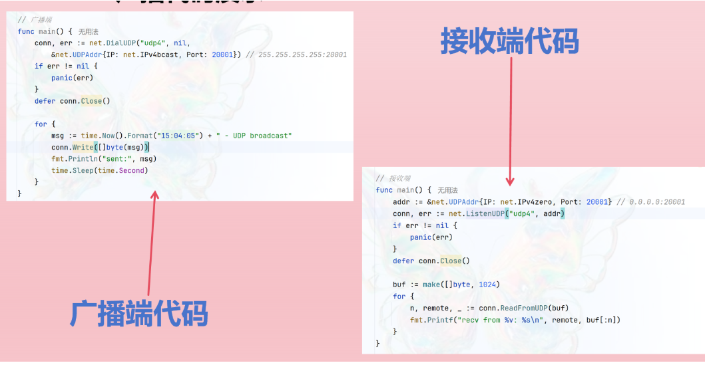
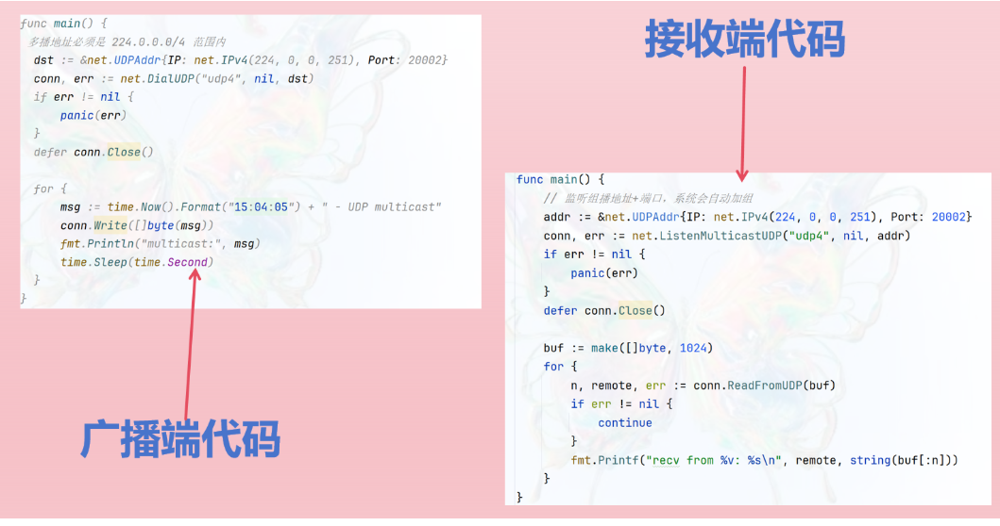

# UDP详解

# 1. UDP的背景

## 1) 先有TCP，后觉笨重
- 在TCP被首次提出后，将“可靠传输，流量控制，拥塞控制”全做在一个协议里。
- 随着应用增多 ——> 很多场景（语音，视频）并不需要万无一失 ——> 更注重 “低延迟，低开销”。

## 2) 拆分与诞生
后来将 TCP 中 “不可靠，无连接” 的部分功能剥离出来，形成了独立的 UDP。

**这样，就出现了两条传输层路线：**

- 需要可靠、顺序交付 ——> 用TCP（面向连接，重传，拥塞控制）
- 只需要快速，尽力投递 ——> 用 UDP （无连接，几乎不增加额外机制）

# 2. UDP的简介

- UDP 是一种在网络通信中使用的传输层协议，是一个简单的、面向无连接的协议。
- UDP用于将数据从一个应用进程发送到另一个应用进程，并在此过程中不提供可靠的数据传输保障。

## 无连接

1. 通信之前不建立，通信之后也不释放任何连接（专属通道）：把每个数据包当独立快递包裹，直接扔出去就算完成任务，不建立，不维护，也不拆除任何长连接。

## 不可靠

2. 发送端发出去的消息在网络传输中一旦丢失，接收端将收不到这个消息。   

   ​

   **引入问题：为什么TCP就比UDP可靠？**请看下文

# 3. 对比 TCP 和 UDP

## ① 数据传输之前会有三次握手来进行连接
- 第一次：服务端确认client发送与自己接收正常
- 第二次：client确认双方发送接收正常
- 第三次：服务端确认双方发送接收正常

## ② 在数据传输时候，有确认、滑动窗口、超时重传、拥塞控制之类机制
- 确认：接收方用来告诉发送方数据已经成功接收
- 滑动窗口：双方各维护一个滑动窗口，发送方根据接收方的确认信号和窗口大小调整自己窗口
- 超时重传：发送方在发送数据后启动一个计时器，超时之前没有收到确认信号，发送方会重传该数据包
- 拥塞控制机制：动态调整发送速率，防止网络拥塞，优化网络性能。

## ③ 数据传输之后进行四次挥手断开连接来节约系统资源。
- 第一次：client告知服务端自己要关闭数据传送
- 第二次：服务端告知client自己收到了
- 第三次：服务端告诉client自己也没话说了准备关闭
- 第四次：client告知服务端自己收到了，然后完全关闭TCP连接

# 4. UDP 特点

## ① 无连接性
这意味着通信的双方不需要在通信之前建立连接。每个UDP数据报都是独立的，它们可以单独发送，没有依赖关系。

## ② 不可靠性
这意味着如果发送的数据丢失或者损坏，UDP不会自动重新发送，需要应用层自行处理。

## ③ 速度与低延迟
由于没有连接状态维护和复杂的确认机制，UDP的开销比TCP小，因此在速度和延迟方面表现更好。这使得它适用于实时应用，如语音通话和在线游戏。

## ④ 数据报格式
UDP数据报包含了目标端口号和源端口号，这些信息用于将数据传递给正确的应用程序。但是，数据报本身没有保证按顺序到达或完整到达。

## ⑤ 无拥塞控制
UDP不具备TCP的拥塞控制机制，因此在网络拥塞的情况下，UDP数据报可能会丢失或延迟增加。

## ⑥ 广播和多播支持
UDP可以像特定组中的多个主机发送数据（多播），也可以将数据广播到网络中的所有主机。

## ⑦ 使用场景
需要快速传输和实时性要求较高的应用。

# 5. UDP 数据报的报文格式



# 6. UDP 多播广播 代码演示

## ① 广播：



## ②多播：



# 7. 如何基于 UDP 实现可靠传输
**[QUIC协议，已经应用在了HTTP/3 要基于 UDP 实现的可靠传输协议，那么就要在应用层下功夫，也就是要设计好协议的头部字段。]()**

接下来给大家逐个介绍一下各个头部：

## ① Packet Header
两部分组成：

1. Long Packet Header = “首次握手时的完整自我介绍”，大而全，用来交换连接 ID、版本、密钥。
2. Short Packet Header = “日常对话的名片”，极简，只保留 Destination Connection ID，实现低延迟传输 + 连接迁移。

设计 ① ：Short Packet Header 中的 Packet Number 是每个报文独一无二的编号，是严格递增的，也就是说即使报文 N 丢失了，重传的Packet Number 也不再是N，而是比N大的值。

**[为什么要这么设计？因为TCP存在的两个问题：]()**

## 一、TCP 的“歧义性 RTT”问题
**在 TCP 里，序号是「字节序号」，重传时必须复用同一个序号。**

示例：

- 原始包 P（序号 1000）在 t₀ 发出。
- 丢包后，发送端重传同一个 P（序号仍为 1000）在 t₁ 发出。
- 接收端收到重传的 P，回 ACK=1000
- 发送端看到 ACK=1000，无法知道这个 ACK 是对第一次还是第二次的确认，于是 RTT = t_now - t_? 就不准了——这就是「重传歧义性」。

## 二、QUIC 的单调递增 PacketNumber 如何消除歧义
**QUIC不重号：**

- 原始包 P 编号 N，在 t₀ 发出。
- 丢包后，发送端把要重传的数据重新封装为一个新包 Q，编号 N+1（或其他更大的号），在t₁时刻发出
- 现在 ACK 链路：

  如果 ACK 的 PacketNumber = N → 说明是原始包 P 的确认 → RTT = t_now - t₀（准确）
  如果 ACK 的 PacketNumber = N+1 → 说明是重传包 Q 的确认 → RTT = t_now - t₁（也准确）。
  永远一一对应，没有歧义。

## 三、乱序确认 & 队头阻塞问题
**TCP的滑动窗口必须顺序确认：**

- 如果包 3 丢了，即使4、5、6已经到达，接收端也只能 ACK = 3
- 发送端看到ACK一直停在 3， 窗口无法右滑，整个流水线被 “队头” 堵住

**QUIC由于 PacketNumber 单调递增解决上述问题：**

- 包 3 丢了，但包4、5、6的ACK可以立即返回 PacketNumber=4、5、6。
- 发送端收到这些较大的 PacketNumber，就知道 “后面的数据已经到”，窗口可以右滑，继续发新数据
- 重传的包 3 会被重新编号（如 7），不会卡住窗口

**总结：**

- 不重号——> ACK永远唯一 ——> RTT 精确
- 独立编号 ——> ACK 可乱序 ——> 窗口不会因为丢包停滞 ——> 解决队头阻塞

## ② QUIC Frame Header
一个 Packet 报文中可以存放多个 QUIC Frame。 每一个 Frame 都有明确的类型，针对类型的不同，功能也不同，自然格式也不同。

作用：

- 通过 Stream ID + Offest 让 QUIC 能在乱序世界里把数据精准拼回原来的顺序

举个例子：

- 数据包 Packet N 丢失了，后面重传该数据包的编号为 Packet N+2， 丢失的数据包和重传的数据包 Stream ID 和 Offest 都一致，说明这两个数据包的内容一致，这些数据包传输到接收端之后，能根据两者的字段信息将 二者进行去重并排序操作。

# 8. 关于 QUIC的四个问题

## ① QUIC 是如何做流量控制的？
QUIC 实现了两种级别的流量控制，分别为 Stream 和 Connection 两种级别

- Stream 级别的流量控制：    
  可以认为就是一条 HTTP 请求，每个 Stream 都有独立的滑动窗口，所以每个 Stream 都可以做流量控制，防止单个 Stream 消耗连接（Connection）的全部接收缓冲。

- Connection 流量控制：    
  限制连接中所有 Stream 相加起来的总字节数，防止发送方超过连接的缓冲容量。

## ② QUIC 如何对拥塞控制进行改进？
QUIC 实现了两种级别的流量控制，分别为 Stream 和 Connection 两种级别

- TCP 流量控制：    
  必须依赖端到端的网络协议栈才能实现控制效果，而内核和操作系统的部署成本非常高，升级周期很长，因此 TCP 拥塞控制算法的迭代速度很慢 。

- QUIC 流量控制：  
  QUIC 处于应用层，应用程序层面就能实现不同的拥塞控制算法，不需要操作系统，也不需要内核支持，并且可以随浏览器更新，其拥塞控制算法能够更快地迭代。

## ③ QUIC 如何而更快的建立

**TCP 握手：**  

​       先TCP握手（1RRT），再TLS 握手（2RTT），          

**QUIC 握手：**        

​       只需要 1RTT，确认双方的 连接ID ，所以说 QUIC建立连接会更快

## ④ QUIC是如何迁移连接的

**TCP ：**  

       基于 TCP 传输协议的 HTTP 协议，通过四元组（源 IP、源端口、目的 IP、目的端口）确定一条 TCP 连接。   
    当移动设备网络从 4G 切换到 Wi-Fi 时，IP 地址发生变化，必须断开原有 TCP 连接并重新建立新连接。          

**QUIC ：**  

     通过 连接 ID 来标记通信的两个端点，双方可以各自选择一组 ID来标记自己，即使网络变化导致 IP 地址变化了之后，只要仍右上下文信息（连接 ID），就可以 无缝 的服用原连接，消除重连的成本

# 9. UDP 的应用场景
# 9. UDP 的应用场景

1. 实时通信：  

```
 视频会议、语音通信、在直播等等，需要UDP提供快速、可靠的服务，满足实时性要求。
```

2. 分布式系统：  

```
 例如在网络存储，云计算等场景中，需要实现大量数据的快速传输。
```

3. 大量数据传输：  

```
 网络爬虫、大数据分析等领域，需要频繁地发送和接收大量数。据
```

4. 端到端通信：  

```
 远程控制，智能家居等领域，UDP可以实现设备间的远程控制功能。
```
**后续会发布相关视频在b站上，欢迎大家来看，发布时会更新贴上视频链接！**[乐茵linn的个人空间-乐茵linn个人主页-哔哩哔哩视频](https://space.bilibili.com/3546559773935897?spm_id_from=333.1387.0.0)，